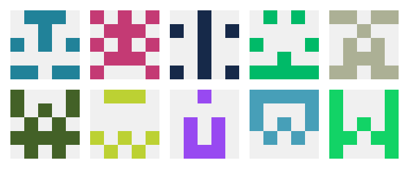

# Identicon

> A golang library for Identicon generation

![Latest Release Version][shields-version-img]
[![Godoc][godoc-image]][godoc-url]

[![Go Report Card][grc-image]][grc-url]
[![codecov][codecov-image]][codecov-url]
[](https://github.com/tsdtsdtsd/identicon/actions/workflows/codeql-analysis.yml)

This Go library helps to generate deterministic [Identicons][identicon-wiki] from strings, like these:



---

⚠️ **v1.0 brings BREAKING CHANGES** ⚠️  

The API changed and also the internal hashing algorithm, so identicons generated after v0.3.2 will look different.  

---

## Usage:

1. Get it:

```sh
go get github.com/tsdtsdtsd/identicon
```

2. Create a new identicon:

```go
black := color.RGBA{0, 0, 0, 255}
red := color.RGBA{255, 0, 0, 255}

icon, err := identicon.New(
    "gary@example.com", 
    // optional:
    identicon.WithResolution(7),      // default: 5
    identicon.WithImageSize(210),     // default: 100
    identicon.WithBGColor(black),     // default: light gray R:240 G:240 B:240 A:255 (#f0f0f0)
    identicon.WithFGColor(red),       // default: based on identifier
    identicon.WithHasher(sha1.New()), // default: fnv128
)
if err != nil {
    log.Fatal(err)
}
```

3. Create an image:

   `Identicon` implements Go's `image.Image`, so you can use the result directly to encode it as an image file:

```go
file, err := os.Create("identicon-gary.png")
if err != nil {
    log.Fatal(err)
}

err = png.Encode(file, icon)
if err != nil {
    log.Fatal(err)
}

file.Close()
```

Identicon also implements Go's `draw.Image`, you can use it to change the output further:

```go
    // TODO: example 
    // draw.Draw(icon, ...
```

## Banner example

You can find another example in the /_example folder. It contains an application, which generates the above image. It also helps me to test the algorythm for changes.

<!-- Markdown link & img dfn's -->
[grc-image]: https://goreportcard.com/badge/github.com/tsdtsdtsd/identicon
[grc-url]: https://goreportcard.com/report/github.com/tsdtsdtsd/identicon
[godoc-image]: https://pkg.go.dev/badge/github.com/tsdtsdtsd/identicon.svg
[godoc-url]: https://pkg.go.dev/github.com/tsdtsdtsd/identicon
[codecov-image]: https://codecov.io/gh/tsdtsdtsd/identicon/branch/main/graph/badge.svg
[codecov-url]: https://codecov.io/gh/tsdtsdtsd/identicon/tree/main
[shields-version-img]: https://img.shields.io/github/v/release/tsdtsdtsd/identicon
[identicon-wiki]: https://en.wikipedia.org/wiki/Identicon
